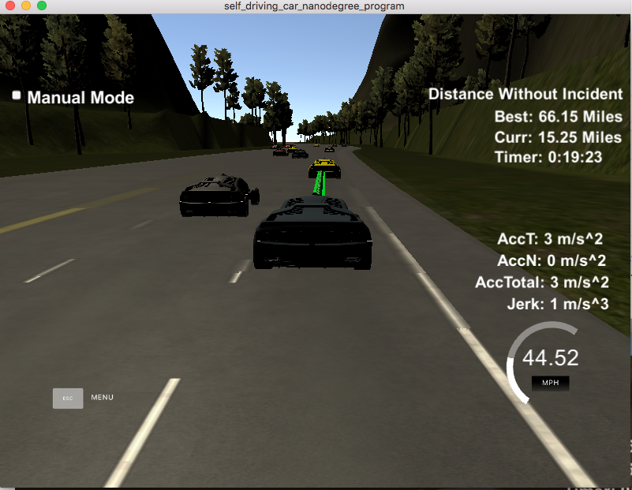

# CarND-Path-Planning-Project
Self-Driving Car Engineer Nanodegree Program
 
### Instructions:
   * download simulator from (https://github.com/udacity/self-driving-car-sim/releases).
   * build:
    Build Instructions
    
    1. Make a build directory: `mkdir build && cd build`
    2. Compile: `cmake .. && make`
    3. Run it: `./path_planning`.

### Goals
In this project the goal is to safely navigate around a virtual highway with other traffic that is driving +-10 MPH of the 50 MPH speed limit.
 The car attempts to go as close as possible to the 50 MPH speed limit, passing slower traffic when possible ( 
 note that other cars will try to change lanes too), avoiding hitting other cars (in front on in the other lanes when passing) at all cost and drives inside of
  the marked road lanes at all times, unless going from one lane to another. The car tries one complete loop around the 6946m highway. Since the car is trying to go 50 MPH, 
   so it takes a little over 5 minutes to complete 1 loop.  Also the car avoids total acceleration over 10 m/s^2 and jerk that is greater than 50 m/s^3.


### Project Implementation / Reflection.
Further down you can find the data and details of this project. Here I shall describe my approach.



Here's a [link to my video result](https://youtu.be/mXp5wVzmi74)

The program's best result was a run of 76 miles without incident. The techniques described in the class (splines, space waypoints to achieve desired velovity) allowed the car to drive without violating any of the requirements (acceleration and kerk limits, don't crash into other cars).


##### Trajectory:

In order to provide a smooth trajectory an interpolation is performed between the end of the previous trajectory, and the new one being calculated. Each cycle starts by assigning to current frenet s the last value of the previous cycle, and recycling two more waypoints at the end of the previous cycle.
 
It then adds 3 waypoints separated by 30m ahead (in frenet coordinates; line 420-430), changes those coordinates to vehicle referenced coordinates (line 433-441) and interpolates them with a spline (line 444-456).
 Note that the end point is on the desired lane, which allows changing to a different lane (spline interpolation creates a smooth trajectory for smooth lane changes )

Next, it generates properly spaced waypoints along this trajectory to achieve the desired velocity (line 459 - 487) 
 
 
In order to change lanes and pass other cars, I implemented the concept of a cost function (line 357), which takes into consideration: 
 - the cost of changing lanes (favors staying in lane) (line 357)
 - the cost of changing to lanes where the average speed of the other cars is different (favors faster lanes) (line 358)
 - the cost of crashing into other cars (make it a very high cost to change into the path of another car) (line 359)
 - the cost of changing to other lanes when other cars are too close, which although doable, increases risk of collision (line 360)
 
 Note: cost of changing lane is estimated as 1000 to change (1*1000) or 0 (0*1000); Some of the costs were scaled between 0-1000, by using a scaling function.
 
 
#### Adjust speed / change lane
 Before a trajectory is planned, sensor fusion data is used to evaluate all nearby objects that are with my 3 lanes and make speed and lane change decisions (lines 281-303).
 
 - All other objects that are detected within the 3 lanes (line 285-286) are evaluated for their lane and speed (line 284 - 295). 
 - A cache of relevant information is kept, including:
   - speed of each car, and count of cars on each lane, to later calculate the average lane speeds (line 294-295)
   - the closest cars on each lane (line 297-303) to later calculate the risk of collision with cars in other lanes.
 - Additionally, if the object is in our lane, its distance is used to determine if it's too close (within 20m, lines 306-317) (thefore our car should slowdown or pass it)
 
 We then can decide to ajust our speed accordingly and/or change lanes:
 - If we're not too close to the car in front, we speed up up to the max allowed velocity (lane 376-387)
 
 - If in fact we are too close, we have to either pass the car, or slow down if passing is not the best option (line 368-369). To pass a car, simply we set the desired lane (line 372-374), and the code to build the trajectory will build a smooth, spline based trajectory into that lane (line 420-422)
 
To determine if the best course of action is to pass a slow vehicle, or stay in lane and slow down, we calculate the cost of each of these actions. We first determine the lanes we can possibly change to, based on our current lane (line 324-332). We then calculate the cost of changing into each lane (including the current late) by considering 4 factors described in the Trajectory section above
  
  
  


## Data

#### Highway Data 
* Highway data is in data/highway_map.txt Each waypoint in the list contains  [x,y,s,dx,dy] values. x and y are the waypoint's map coordinate position, the s value is the distance along the road to get to that waypoint in meters, the dx and dy values define the unit normal vector pointing outward of the highway loop.

The highway's waypoints loop around so the frenet s value, distance along the road, goes from 0 to 6945.554.

#### Data provided from the Simulator to the C++ Program is:

* Main car's localization Data (No Noise)

        ["x"] The car's x position in map coordinates
        
        ["y"] The car's y position in map coordinates
        
        ["s"] The car's s position in frenet coordinates
        
        ["d"] The car's d position in frenet coordinates
        
        ["yaw"] The car's yaw angle in the map

        ["speed"] The car's speed in MPH

* Previous path data given to the Planner  (previous list but with processed points removed):

        ["previous_path_x"] The previous list of x points previously given to the simulator
        
        ["previous_path_y"] The previous list of y points previously given to the simulator

* Previous path's end s and d values 

        ["end_path_s"] The previous list's last point's frenet s value
        
        ["end_path_d"] The previous list's last point's frenet d value

* Sensor Fusion Data, a list of all other car's attributes on the same side of the road. (No Noise)

        ["sensor_fusion"] A 2d vector of cars and then that car's [car's unique ID, car's x position in map coordinates, car's y position in map coordinates, car's x velocity in m/s, car's y velocity in m/s, car's s position in frenet coordinates, car's d position in frenet coordinates. 

## Details

1. The car uses a perfect controller and will visit every (x,y) point it receives in the list every .02 seconds. The units for the (x,y) points are in meters and the spacing of the points determines the speed of the car. The vector going from a point to the next point in the list dictates the angle of the car. Acceleration both in the tangential and normal directions is measured along with the jerk, the rate of change of total Acceleration. The (x,y) point paths that the planner recieves should not have a total acceleration that goes over 10 m/s^2, also the jerk should not go over 50 m/s^3. (NOTE: As this is BETA, these requirements might change. Also currently jerk is over a .02 second interval, it would probably be better to average total acceleration over 1 second and measure jerk from that.

2. There will be some latency between the simulator running and the path planner returning a path, with optimized code usually its not very long maybe just 1-3 time steps. During this delay the simulator will continue using points that it was last given, because of this its a good idea to store the last points you have used so you can have a smooth transition. previous_path_x, and previous_path_y can be helpful for this transition since they show the last points given to the simulator controller with the processed points already removed. You would either return a path that extends this previous path or make sure to create a new path that has a smooth transition with this last path.

## Smooth trajectories

To create smooth trjectories, one can use splines. A really helpful resource for creating smooth trajectories is this spline library: http://kluge.in-chemnitz.de/opensource/spline/.

---

## Dependencies

* cmake >= 3.5
 * All OSes: [click here for installation instructions](https://cmake.org/install/)
* make >= 4.1
  * Linux: make is installed by default on most Linux distros
  * Mac: [install Xcode command line tools to get make](https://developer.apple.com/xcode/features/)
  * Windows: [Click here for installation instructions](http://gnuwin32.sourceforge.net/packages/make.htm)
* gcc/g++ >= 5.4
  * Linux: gcc / g++ is installed by default on most Linux distros
  * Mac: same deal as make - [install Xcode command line tools]((https://developer.apple.com/xcode/features/)
  * Windows: recommend using [MinGW](http://www.mingw.org/)
* [uWebSockets](https://github.com/uWebSockets/uWebSockets)
  * Run either `install-mac.sh` or `install-ubuntu.sh`.
  * If you install from source, checkout to commit `e94b6e1`, i.e.
    ```
    git clone https://github.com/uWebSockets/uWebSockets 
    cd uWebSockets
    git checkout e94b6e1
    ```
